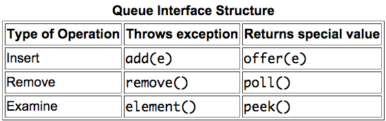
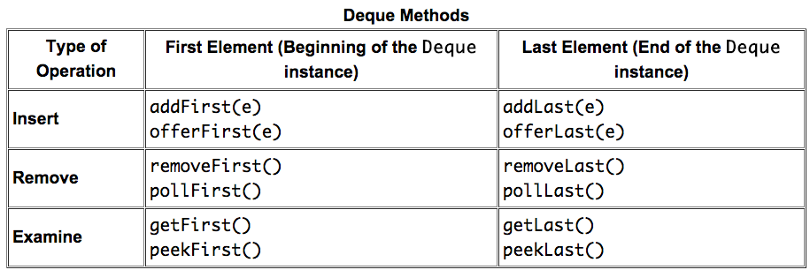
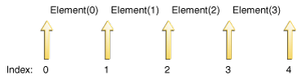

Collection
====

## Outline

- [前言](#前言)
	+ [什麼是容器](#什麼是容器)
	+ [泛型與容器](#泛型與容器)
- [Collection介面](#collection介面)
	+ [Set](#set)
		* [HashSet](#hashset)
		* [TreeSet](#treeset)
		* [NavigableSet](#navigableset)
	+ [Map](#map)
	+ [List](#list)
	+ [Queue](#queue)
	+ [Dequeue](#dequeue)
- [Object class](#object-class)
- [Comparator](#comparator)
- [Iterator](#iterator)
- [Java Collection Framework](#java-collection-framework)
- [Utilities](#utilities)
	+ [Arrays](#arrays)
	+ [Collections](#collections)
- [其他議題](#其他議題)


## 前言

### 什麼是容器

存放物件或是屬性的地方，就之前所看到`Array`. 但是`Array`有以下缺點：

- 大小固定
- 編譯之前就必須知道切確型別

所以Java提供了一系列的工具可以使用，都在[java.util][java.util]裏。

### 泛型與容器

此部分的程式碼可以參考[DemoBasicCollection][DemoBasicCollection]。

首先我先用沒有**泛型**的方式來Demo：

```java
	@SuppressWarnings("unchecked")
	public static void main(String[] args) {
		ArrayList apples = new ArrayList();
		apples.add(new Apple());
		apples.add(new Orange());
		
		Apple aApple = (Apple) apples.get(0);
		System.out.println(aApple.getClass().getSimpleName() + "\t" + aApple.getId());
		
		//Here will get java.lang.ClassCastException (run time)
		//Apple bApple = (Apple) apples.get(1);
		//System.out.println(aApple.getClass().getSimpleName() + "\t" + aApple.getId());
	}
```

以上的加的方法為：[ArrayList.add(Object e)][ArrayList.html#add(E)]。
反之，用get回傳的形態依然也是`Object`。因此使用時，要自行轉型。
這樣子除了會發生像註解處的錯誤，而且在編譯時找不出來。就算可以找出來，程式碼也不易讀，很冗長。
因此，Java提供了**泛型**的機制，來避免上述問題。

```java
	public static void main(String[] args) {
		ArrayList<Apple2> apples = new ArrayList<Apple2>();
		apples.add(new Apple2());
		
		//below will get :
		//	Description	Resource	Path	Location	Type
		//	The method add(Apple2) in the type ArrayList<Apple2> is not applicable 
		//		for the arguments (Orange)	
		//apples.add(new Orange2());
		
		Apple2 aApple = apples.get(0);
		System.out.println(aApple.getClass().getSimpleName() + "\t" + aApple.getId());
		
		//Here will get java.lang.ClassCastException
		//Apple bApple = (Apple) apples.get(1);
		//System.out.println(aApple.getClass().getSimpleName() + "\t" + aApple.getId());
	}
```
仔細觀察以上兩個版本的差異。

再來，我們可以仔細觀察API，發現ArrayList實作`Collection`，因此我們可以用**foreach**的方式來遍歷。

```java
	public static void main(String[] args) {
		Collection<Integer> c = new ArrayList<Integer>();
		for (int i = 0; i < 10; i++) {
			c.add(i);	//auto boxing
		}
		
		for (Integer integer : c) {
			System.out.println(integer);	//auto unboxing
		}
	}
```
## Collection介面

最初，先看[Collection.html][Collection.html]。以下整理幾點：

- Some collections allow duplicate elements and others do not.
- Some are ordered and others unordered. 
- This interface is typically used to pass collections around and manipulate them where maximum generality is desired.
- should provide two "standard" constructors: a void (no arguments) constructor, which creates an empty collection, and a constructor with a single argument of type Collection.
- The "destructive" methods contained in this interface, that is, the methods that modify the collection on which they operate, are specified to throw `UnsupportedOperationException` if this collection does not support the operation.
	+ `add(E e)`: Returns true if this collection changed as a result of the call
	+ `addAll(Collection<? extends E> c)`: Returns true if this collection changed as a result of the call
	+ `remove(Object o)`: Returns true if an element was removed as a result of this call
	+ `removeAll(Collection<?> c)`: Returns true if an element was removed as a result of this call
	+ `retainAll(Collection<?> c)`: Returns true if this collection changed as a result of the call
- some implementations prohibit null elements, and some have restrictions on the types of their elements. Attempting to add an ineligible element throws an unchecked exception, typically `NullPointerException` or `ClassCastException`.
- Many methods in Collections Framework interfaces are defined in terms of the `equals` method.
	+ For example, the specification for the contains(Object o) method says: "returns true if and only if this collection contains at least one element e such that (o==null ? e==null : o.equals(e))." 
- It extends [Iterable<E>][Iterable.html]
	+ Implementing this interface allows an object to be the target of the "foreach" statement.

官方文件上的個點都非常重要，在後文中也會陸續提到，務必掌握。

### Set
API of [Map][Set.html]:
- A collection that contains **no** duplicate elements. More formally, sets contain no pair of elements e1 and e2 such that e1.equals(e2), and at most one null element. As implied by its name, this interface models the mathematical set abstraction.

The Java platform contains three general-purpose Set implementations: HashSet, TreeSet, and LinkedHashSet. 
- `HashSet`, which stores its elements in a hash table, is the best-performing implementation; however it makes no guarantees concerning the order of iteration. 
- `TreeSet`, which stores its elements in a red-black tree, orders its elements based on their values; it is substantially slower than HashSet. 
- `LinkedHashSet`, which is implemented as a hash table with a linked list running through it, orders its elements based on the order in which they were inserted into the set (insertion-order). LinkedHashSet spares its clients from the unspecified, generally chaotic ordering provided by HashSet at a cost that is only slightly higher.

#### HashSet
`boolean	contains(Object o)`:
- 先檢查hashCode是否有一樣的，沒有則回傳false
- 如果有一樣的，檢查到有equals()為真時，回傳true 

參見文後範例。

#### TreeSet

- Source Code
	
	```java
	public class TreeSet<E>
	extends AbstractSet<E>
	implements NavigableSet<E>, Cloneable, Serializable{......}
	```
- The elements are ordered using their natural ordering, or by a Comparator provided at set creation time, depending on which constructor is used.
- All Implemented Interfaces:
	+ Serializable
	+ Cloneable
	+ Iterable<E>
	+ Collection<E>
	+ NavigableSet<E>
	+ Set<E>
	+ SortedSet<E>
- Constructor:
	+ `TreeSet()`: Constructs a new, empty tree set, sorted according to the **natural ordering** of its elements.
	+ `TreeSet(Collection<? extends E> c)`: Constructs a new tree set containing the elements in the specified collection, sorted according to the **natural ordering** of its elements.
	+ `TreeSet(Comparator<? super E> comparator)`: Constructs a new, empty tree set, sorted according to the specified comparator.
	+ `TreeSet(SortedSet<E> s)`: TreeSet(SortedSet<E> s)


#### NavigableSet

- Methods `subSet(E, E)`, `headSet(E)`, and `tailSet(E)` are specified to return `SortedSet` to allow existing implementations of SortedSet to be compatibly retrofitted to implement NavigableSet, but extensions and implementations of this interface are encouraged to override these methods to return NavigableSet.

範例可以很清楚了解內涵：

```java
	public static void main(String[] args) {
		NavigableSet<Integer> set = new TreeSet<Integer>();
		for (int i = 1; i < 11; i += 2) {
			set.add(i);// auto boxing
		}
		NavigableSet<Integer> subSet = set.subSet(1, true, 5, true);
		
		//[1, 3, 5, 7, 9]	[1, 3, 5]
		System.out.println(set + "\t" + subSet);
		
		subSet.remove(3);
		//[1, 5, 7, 9]	[1, 5]
		System.out.println(set + "\t" + subSet);
		
		set.add(4);
		//[1, 4, 5, 7, 9]	[1, 4, 5]
		System.out.println(set + "\t" + subSet);
		
		//get java.lang.IllegalArgumentException: key out of range
		//subSet.add(6);
	}
```

### Map

API of [Map][Map.html]:
- An object that maps keys to values. A map **cannot** contain duplicate keys; each key can map to at most one value.
- methods 
	+ basic operations 
		* put
		* get
		* remove
		* containKey
		* containValue
		* size
		* empty
	+ bulk operation
		* putAll
		* clear
	+ collection views
		* keySet
		* entrySet
		* values
- The Collection views **do not** support element addition under any circumstances. 

Here is the example on basic operations and bulk operations.

```java
	import java.util.HashMap;
	import java.util.LinkedHashMap;
	import java.util.Map;
	import java.util.TreeMap;

	public class DemoBasicOperation {

		public static void main(String[] args) {
			Map<String, Integer> map = new HashMap<String, Integer>();
			initializeMap(map);
			System.out.println(map);	//{happy=1, am=2, good=1, I=2}
			
			map = new TreeMap<String, Integer>();
			initializeMap(map);
			System.out.println(map);	//{I=2, am=2, good=1, happy=1}: in alphabetical order
			
			//all general-purpose Map implementations provide constructors that take a Map object 
			//and initialize the new Map to contain all the key-value mappings in the specified Map.
			map = new LinkedHashMap<String, Integer>(map);
			System.out.println(map);	//{I=2, am=2, good=1, happy=1}
			
			
			System.out.println(map);
			
			Map<String, Integer> map2 = new HashMap<String, Integer>();
			map2.putAll(map);
			System.out.println(map2);	//{happy=1, am=2, good=1, I=2}
			
			map2.clear();
			System.out.println(map2);	//{}

		}
		public static final String[] LIST = "I am happy. I am good".split("[.,]?\\s+");
		public static void initializeMap(Map<String, Integer> map){
			for (String string : LIST) {
				Integer i = map.get(string);
				map.put(string, (i == null) ? 1 : i + 1);
			}
		}

	}

```

Demo collection view:

```java
	import java.util.HashMap;
	import java.util.HashSet;
	import java.util.Map;
	import java.util.Set;

	public class DemoCollectionView {

		public static final String[] LIST = "I am happy. I am good"
				.split("[.,]?\\s+");

		static <K, V> boolean validate(Map<K, V> attrMap, Set<K> requiredAttrs,
				Set<K> permittedAttrs) {
			boolean valid = true;
			Set<K> attrs = attrMap.keySet();

			if (!attrs.containsAll(requiredAttrs)) {
				Set<K> missing = new HashSet<K>(requiredAttrs);
				missing.removeAll(attrs);
				System.out.println("Missing attributes: " + missing);
				valid = false;
			}
			if (!permittedAttrs.containsAll(attrs)) {
				Set<K> illegal = new HashSet<K>(attrs);
				illegal.removeAll(permittedAttrs);
				System.out.println("Illegal attributes: " + illegal);
				valid = false;
			}
			return valid;
		}

		public static Map<String, Integer> getMap() {
			Map<String, Integer> map = new HashMap<String, Integer>();
			for (String string : LIST) {
				Integer i = map.get(string);
				map.put(string, (i == null) ? 1 : i + 1);
			}
			return map;
		}

		public static void main(String[] args) {

			Map<String, Integer> map = getMap();
			
			//throw  java.lang.UnsupportedOperationException
			//map.keySet().add("123");
			Set<String> requiredAttrs = new HashSet<String>(map.keySet());
			requiredAttrs.add("123");
			Set<String> permittedAttrs = new HashSet<String>(map.keySet());
			permittedAttrs.add("234");
			map.put("adsf",2);
			System.out.println(validate(map, requiredAttrs, permittedAttrs));
		}
	}

```

### List
[API][List.html]:
- Implementing Classes:
	+ ArrayList
	+ LinkedList
- An ordered collection
- The user can access elements by their integer **index** (position in the list)
- Unlike sets, lists typically allow **duplicate** elements. More formally, lists typically allow pairs of elements e1 and e2 such that e1.equals(e2), and they typically **allow** multiple `null` elements if they allow null elements at all.
- Part of Method
	+ basic operations
		* `void	add(int index, E element)`:  (optional operation)
		* `boolean	remove(Object o)`: (optional operation) Removes the **first** occurrence of the specified element from this list, if it is present 
		* `E	remove(int index)`: (optional operation)
		* `boolean	contains(Object o)`: (optional operation)
		* `E	get(int index)`
		* `int	indexOf(Object o)`:	Returns the index of the first occurrence of the specified element in this list, or **-1** if this list does not contain the element.
	+ bulk operations
		* `boolean	addAll(Collection<? extends E> c)`:  (optional operation)
		* `void	clear()`: (optional operation) 
		* `boolean	retainAll(Collection<?> c)`: (optional operation)
		* `boolean	retainAll(Collection<?> c)`
	+ `Iterator<E>	iterator()`
	+ `ListIterator<E>	listIterator()`
	+ `Object[]	toArray()`

### Queue
[API][Queue.html]:
- Part of Method
	+ `E	element()`:	Retrieves, but does **not** remove, the head of this queue.
		* Throws: `NoSuchElementException` if this queue is empty
	+ `E	peek()`: Retrieves, but does **not** remove, the head of this queue, or returns **null** if this queue is empty.
	+ `boolean	offer(E e)`
	+ `E	remove()`: Retrieves and removes the head of this queue.
		* Throws: `NoSuchElementException` if this queue is empty
	+ `E	poll()`: Retrieves and removes the head of this queue, or returns null if this queue is empty.
	+ `boolean	add(E e)`: Inserts the specified element into this queue if it is possible to do so immediately without violating **capacity restrictions**, returning true upon success and throwing an IllegalStateException if no space is currently available.
		* Throws:
			- `IllegalStateException` - if the element cannot be added at this time due to capacity restrictions 
			- `ClassCastException` - if the class of the specified element prevents it from being added to this queue 
			- `NullPointerException` - if the specified element is null and this queue does not permit null elements
			- `IllegalArgumentException` - if some property of this element prevents it from being added to this queue
- Use `peek`, `poll`, `offer` to avoid `NoSuchElementException`
- It is possible for a Queue implementation to restrict the number of elements that it holds.(**bounded**)
	+ Some Queue implementations in java.util.concurrent are bounded, but the implementations in java.util are not.
	+ It may throws IllegalStateException

Each Queue method exists in two forms:
- one throws an exception if the operation fails
- the other returns a special value if the operation fails (either null or false, depending on the operation). 
- 

Example:

```java
	import java.util.LinkedList;
	import java.util.Queue;

	public class CountDown {

		public static void main(String[] args) throws InterruptedException {
			Queue<Integer> queue = new LinkedList<Integer>();

			for (int i = 10; i >= 0; i--)
				queue.add(i);

			while (!queue.isEmpty()) {
				System.out.println(queue.remove());
				Thread.sleep(100);
			}
			
			for(int i = 10; i >= 0; i--)
				queue.offer(i);
			
			Integer i ;
			while (  (i = queue.poll()) != null ) {
				System.out.println(i);
				Thread.sleep(100);
			}
		}

	}

```

### Dequeue

- Usually pronounced as deck, a deque is a double-ended-queue.
- both Stack and Queue
- 


## Object class

`boolean	equals(Object obj)` are method of `Object`.
我們可以用String物件來理解equals。

```java
	public static void main(String[] args) {
		String a = new String("123");
		System.out.println(a == "123");			//get false
		System.out.println(a.equals("123"));	//get true
		
		Dog b = new Dog(1);
		Dog c = new Dog(1);
		System.out.println(b.equals(b));		//get true
		System.out.println(b.equals(c));		//get false
	}
```

See the source code:

```java
  public static boolean equal(@Nullable Object a, @Nullable Object b) {
    return a == b || (a != null && a.equals(b));
  }
```

另外一個跟collection比較有關的function為`public int hashCode()`。

The general contract of hashCode is:

- Whenever it is invoked on the same object more than once during an execution of a Java application, the hashCode method must consistently return the **same integer**, provided no information used in equals comparisons on the object is modified. This integer need not remain consistent from one execution of an application to another execution of the same application.
- If two objects are equal according to the equals(Object) method, then calling the hashCode method on each of the two objects **must** produce the same integer result.
- It is not required that if two objects are unequal according to the equals(java.lang.Object) method, then calling the hashCode method on each of the two objects must produce distinct integer results. However, the programmer should be aware that producing distinct integer results for unequal objects may improve the performance of hash tables.

來看下面範例，以了解equals, hashCode 跟collection的關係。

```java
	import java.util.Collection;
	import java.util.HashSet;
	import java.util.LinkedList;

	public class CollectionAndEquals {

		public static void main(String[] args) {
			Cat a = new Cat("123");
			Cat b = new Cat("123");

			Collection<Cat> setOfCat = new HashSet<Cat>();
			setOfCat.add(a);
			System.out.println(setOfCat.contains(b)); // return false

			Pig c = new Pig("123");
			Pig d = new Pig("123");
			Collection<Pig> setOfPig = new LinkedList<Pig>();
			setOfPig.add(c);
			System.out.println(setOfPig.contains(d)); // return ture
			setOfPig = new HashSet<Pig>();
			setOfPig.add(c);
			System.out.println(setOfPig.contains(d)); // return false
			
			c = new Pig2("123");
			d = new Pig2("123");
			setOfPig = new HashSet<Pig>();
			setOfPig.add(c);
			System.out.println(setOfPig.contains(d)); // return ture
			
			

		}

	}

	class Cat {
		String name;

		public Cat(String name) {
			super();
			this.name = name;
		}
	}


	class Pig {
		String name;

		public Pig(String name) {
			super();
			this.name = name;
		}

		@Override
		public boolean equals(Object obj) {
			if (obj == null || !(obj instanceof Pig)) {
				return false;
			} else {
				return this.name.equals(((Pig)obj).name);
			}

		}
	}

	class Pig2 extends Pig{
		public Pig2(String name) {
			super(name);
		}
		
		@Override
		public int hashCode() {
			return super.name.hashCode();
		}
	}
```

## Comparator

See below code:

```java
	import java.util.Collection;
	import java.util.Comparator;
	import java.util.TreeSet;

	public class DemoTreeSet {

		public static void main(String[] args) {
			Collection<Dog> set = new TreeSet<Dog>();
			set.add(new Dog(10));
			set.add(new Dog(5));
			boolean success = set.add(new Dog(5));	//false: if duplicated (compare function return 0 == same)
			set.add(new Dog(7));
			
			System.out.println(success);
			
			System.out.println(set);
			for (Dog dog : set) {
				System.out.println(dog.age);
			}

			Collection<Dog> set2 = new TreeSet<Dog>(new Comparator<Dog>() {

				@Override
				public int compare(Dog arg0, Dog arg1) {
					return arg1.age - arg0.age;
				}
			});
			
			set2.addAll(set);
			System.out.println(set);
			for (Dog dog : set2) {
				System.out.println(dog.age);
			}
			
		}

	}

	class Dog implements Comparable<Dog> {
		int age;

		Dog(int age) {
			this.age = age;
		}

		@Override
		public int compareTo(Dog arg0) {
			return this.age - arg0.age;
		}
	}
```

## Iterator

The `remove` method may be called only once per call to next and throws an exception if this rule is violated.

Use Iterator instead of the for-each construct when you need to:
- Remove the current element. The for-each construct hides the iterator, so you cannot call remove. Therefore, the for-each construct is not usable for filtering.
- Iterate over multiple collections in parallel.

The operation of `ListIterator` which is extend the interface `Iterator` is complex.
- 
- Calls to next and previous can be intermixed, but you have to be a bit careful. The first call to previous returns the same element as the last call to next. Similarly, the first call to next after a sequence of calls to previous returns the same element as the last call to previous.
- `set` or `remove` functions are change/remove the last returned object(by `next` or `previous`).

I use `ListIterator` to demo. 

```java
	import java.util.LinkedList;
	import java.util.ListIterator;

	public class BasicIteratorDemo {

		public static void main(String[] args) {
			LinkedList<Integer> set = new LinkedList<Integer>();
			for (int i = 0; i <= 4; i++) {
				set.add(i);
			}

			ListIterator<Integer> iterator = set.listIterator();
			while (iterator.hasNext()) {
				System.out.println(iterator.nextIndex() + "\t" + iterator.next());
			}
			
			System.out.println(iterator.nextIndex());
			System.out.println(iterator.previousIndex());

			while (iterator.hasPrevious()) {
				System.out.println(iterator.previousIndex() + "\t" + iterator.previous());
			}
			
			iterator.remove();	//1 will be remove

			//throw java.lang.IllegalStateException
			//iterator.remove();
			System.out.println(set);  //[2, 3, 4, 5]
		}

	}
```

## Java Collection Framework


Java將容器分成兩種：

1.	Collection：各自獨立的元素
	
	1.	List
	2. 	Set
	3. 	Queue
2. 	Map：key-value成對


## Utilities

### Arrays

觀察[API][Arrays.html]。

- This class contains various methods for manipulating arrays (such as sorting and searching). This class also contains a static factory that allows arrays to be viewed as lists.
- `static <T> List<T>	asList(T... a)`
- `static String	toString(Object[] a)`

### Collections

觀察[API][Collections.html]。

- This class consists exclusively of static methods that operate on or return collections. It contains polymorphic algorithms that operate on collections, "wrappers", which return a new collection backed by a specified collection, and a few other odds and ends.
- The methods of this class all throw a `NullPointerException` if the collections or class objects provided to them are null.
- The "destructive" algorithms contained in this class, that is, the algorithms that modify the collection on which they operate, are specified to throw `UnsupportedOperationException` if the collection does not support the appropriate mutation primitive(s), such as the set method. 
	+ For example, invoking the sort method on an unmodifiable list that is already sorted may or may not throw UnsupportedOperationException.
-	`static <T> boolean	addAll(Collection<? super T> c, T... elements)`
-	`static void	shuffle(List<?> list)`
-	`static <T extends Comparable<? super T>> void	sort(List<T> list)`
-	`static <T> int	binarySearch(List<? extends Comparable<? super T>> list, T key)`
-	`static <T> int	binarySearch(List<? extends T> list, T key, Comparator<? super T> c)`
	+	Searches the specified list for the specified object using the binary search algorithm. The list must be sorted into **ascending order according** to the specified `comparator` (as by the `sort(List, Comparator)` method), prior to making this call.
	+	Returns the index of the search key, if it is contained in the list; 
		otherwise, **(-(insertion point) - 1)**. The insertion point is defined as the point at which the key would be inserted into the list: the index of the first element greater than the key, or list.size() if all elements in the list are less than the specified key. Note that this guarantees that the return value will be >= 0 if and only if the key is found.
	+	Boolean, Integer, Float, Double ... all implement [Comparable][Comparable.html]. That can use `Collections.sort` to sort without need of implementing `Comparable`.

## 其他議題

- Auto-box/unbox
- SuppressWarnings annotation

## 參考文獻
- [SCJP 6.0認證教戰手冊(第二版) 12章](https://docs.google.com/file/d/0BxoRjjtYAmGnLVhwREFRSkU2RXM/edit)
- [Java Tutorial by Oracle](http://docs.oracle.com/javase/tutorial/collections/index.html)

[java.util]: http://docs.oracle.com/javase/7/docs/api/java/util/package-summary.html
[DemoBasicCollection]: DemoBasicCollection
[ArrayList.html#add(E)]: http://docs.oracle.com/javase/7/docs/api/java/util/ArrayList.html#add(E)
[Collection.html]: http://docs.oracle.com/javase/7/docs/api/java/util/Collection.html
[Collections.html]: http://docs.oracle.com/javase/7/docs/api/java/util/Collections.html
[Iterable.html]: http://docs.oracle.com/javase/7/docs/api/java/lang/Iterable.html
[Arrays.html]: http://docs.oracle.com/javase/7/docs/api/java/util/Arrays.html
[Comparable.html]: http://docs.oracle.com/javase/7/docs/api/java/lang/Comparable.html
[Map.html]: http://docs.oracle.com/javase/7/docs/api/java/util/Map.html
[Set.html]: http://docs.oracle.com/javase/7/docs/api/java/util/Set.html
[List.html]: http://docs.oracle.com/javase/7/docs/api/java/util/List.html
[Queue.html]: http://docs.oracle.com/javase/7/docs/api/java/util/Queue.html