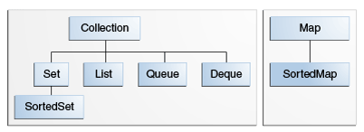
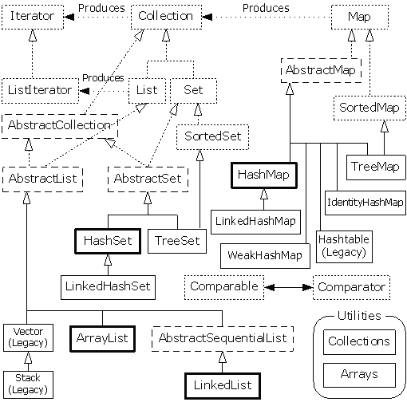

Collection
====

## Outline

- [前言](#前言)
- [什麼是容器（群集）？](#什麼是容器)
- [Collection介面](#collection介面)
- [Java Collection Framework](#java-collection-framework)
- [Utilities](#utilities)


## 前言

### 什麼是容器

存放物件或是屬性的地方，就之前所看到`Array`. 但是`Array`有以下缺點：

- 大小固定
- 編譯之前就必須知道切確型別

所以Java提供了一系列的工具可以使用，都在[java.util][java.util]裏。

### 簡易Demo -- 泛型、Collection介面

此部分的程式碼可以參考[DemoBasicCollection][DemoBasicCollection]。

首先我先用沒有**泛型**的方式來Demo：

```java
	@SuppressWarnings("unchecked")
	public static void main(String[] args) {
		ArrayList apples = new ArrayList();
		apples.add(new Apple());
		apples.add(new Orange());
		
		Apple aApple = (Apple) apples.get(0);
		System.out.println(aApple.getClass().getSimpleName() + "\t" + aApple.getId());
		
		//Here will get java.lang.ClassCastException (run time)
		//Apple bApple = (Apple) apples.get(1);
		//System.out.println(aApple.getClass().getSimpleName() + "\t" + aApple.getId());
	}
```

以上的加的方法為：[ArrayList.add(Object e)][ArrayList.html#add(E)]。
反之，用get回傳的形態依然也是`Object`。因此使用時，要自行轉型。
這樣子除了會發生像註解處的錯誤，而且在編譯時找不出來。就算可以找出來，程式碼也不易讀，很冗長。
因此，Java提供了**泛型**的機制，來避免上述問題。

```java
	public static void main(String[] args) {
		ArrayList<Apple2> apples = new ArrayList<Apple2>();
		apples.add(new Apple2());
		
		//below will get :
		//	Description	Resource	Path	Location	Type
		//	The method add(Apple2) in the type ArrayList<Apple2> is not applicable 
		//		for the arguments (Orange)	
		//apples.add(new Orange2());
		
		Apple2 aApple = apples.get(0);
		System.out.println(aApple.getClass().getSimpleName() + "\t" + aApple.getId());
		
		//Here will get java.lang.ClassCastException
		//Apple bApple = (Apple) apples.get(1);
		//System.out.println(aApple.getClass().getSimpleName() + "\t" + aApple.getId());
	}
```
仔細觀察以上兩個版本的差異。

再來，我們可以仔細觀察API，發現ArrayList實作`Collection`，因此我們可以用**foreach**的方式來遍歷。

```java
	public static void main(String[] args) {
		Collection<Integer> c = new ArrayList<Integer>();
		for (int i = 0; i < 10; i++) {
			c.add(i);	//auto boxing
		}
		
		for (Integer integer : c) {
			System.out.println(integer);	//auto unboxing
		}
	}
```
## Collection介面

最初，先看[Collection.html][Collection.html]。以下整理幾點：

- Some collections allow duplicate elements and others do not.
- Some are ordered and others unordered. 
- This interface is typically used to pass collections around and manipulate them where maximum generality is desired.
- should provide two "standard" constructors: a void (no arguments) constructor, which creates an empty collection, and a constructor with a single argument of type Collection.
- The "destructive" methods contained in this interface, that is, the methods that modify the collection on which they operate, are specified to throw `UnsupportedOperationException` if this collection does not support the operation.
	+ `add(E e)`
	+ `addAll(Collection<? extends E> c)`
	+ `remove(Object o)`
	+ `removeAll(Collection<?> c)`
	+ `retainAll(Collection<?> c)`
- some implementations prohibit null elements, and some have restrictions on the types of their elements. Attempting to add an ineligible element throws an unchecked exception, typically `NullPointerException` or `ClassCastException`.
- Many methods in Collections Framework interfaces are defined in terms of the `equals` method.
	+ For example, the specification for the contains(Object o) method says: "returns true if and only if this collection contains at least one element e such that (o==null ? e==null : o.equals(e))." 
- It extends [Iterable<E>][Iterable.html]
	+ Implementing this interface allows an object to be the target of the "foreach" statement.
官方文件上的個點都非常重要，在後文中也會陸續提到，務必掌握。


## Java Collection Framework

在正式討論前先看下圖。




Java將容器分成兩種：

1.	Collection：各自獨立的元素
	
	1.	List
	2. 	Set
	3. 	Queue
2. 	Map：key-value成對

## Utilities

### Arrays

觀察[API][Arrays.html]。

- This class contains various methods for manipulating arrays (such as sorting and searching). This class also contains a static factory that allows arrays to be viewed as lists.
- `static <T> List<T>	asList(T... a)`
- `static String	toString(Object[] a)`

### Collections

觀察[API][Collections.html]。

- This class consists exclusively of static methods that operate on or return collections. It contains polymorphic algorithms that operate on collections, "wrappers", which return a new collection backed by a specified collection, and a few other odds and ends.
- The methods of this class all throw a `NullPointerException` if the collections or class objects provided to them are null.
- The "destructive" algorithms contained in this class, that is, the algorithms that modify the collection on which they operate, are specified to throw `UnsupportedOperationException` if the collection does not support the appropriate mutation primitive(s), such as the set method. 
	+ For example, invoking the sort method on an unmodifiable list that is already sorted may or may not throw UnsupportedOperationException.
-	`static <T> boolean	addAll(Collection<? super T> c, T... elements)`
-	`static void	shuffle(List<?> list)`
-	`static <T extends Comparable<? super T>> void	sort(List<T> list)`

## 其他議題

- Auto-box/unbox
- SuppressWarnings annotation

[java.util]: http://docs.oracle.com/javase/7/docs/api/java/util/package-summary.html
[DemoBasicCollection]: DemoBasicCollection
[ArrayList.html#add(E)]: http://docs.oracle.com/javase/7/docs/api/java/util/ArrayList.html#add(E)
[Collection.html]: http://docs.oracle.com/javase/7/docs/api/java/util/Collection.html
[Collections.html]: http://docs.oracle.com/javase/7/docs/api/java/util/Collections.html
[Iterable.html]: http://docs.oracle.com/javase/7/docs/api/java/lang/Iterable.html
[Arrays.html]: http://docs.oracle.com/javase/7/docs/api/java/util/Arrays.html